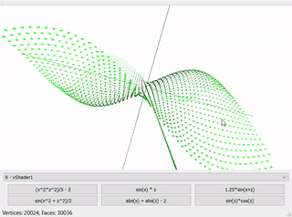
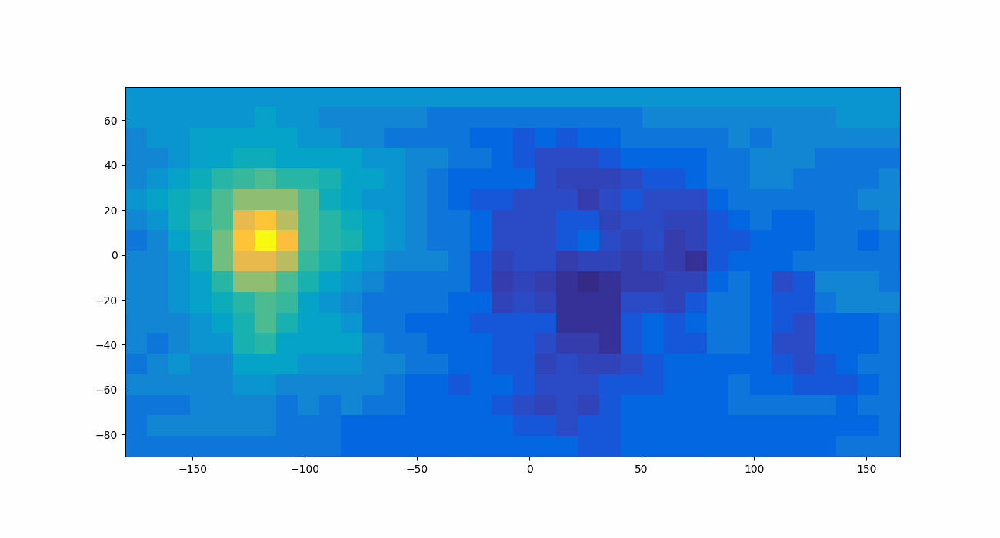
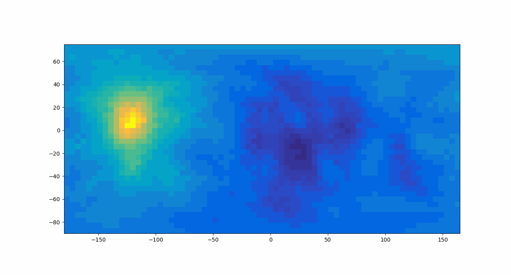
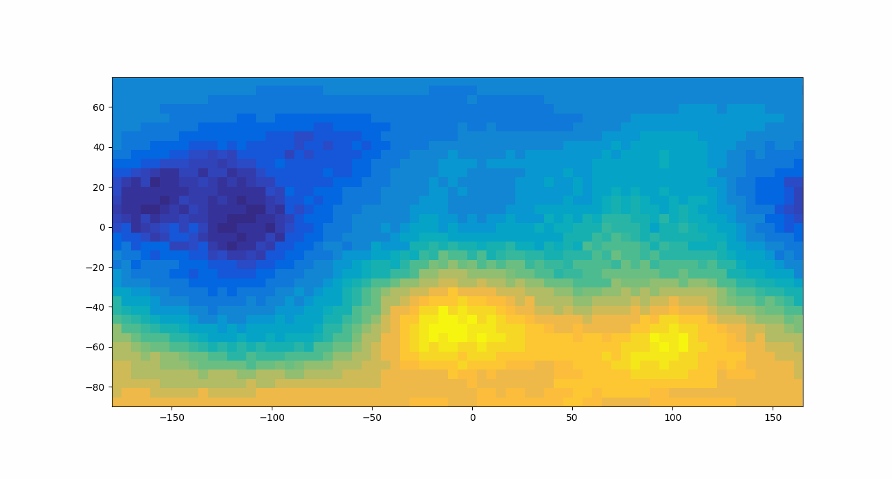

# qt-function-plot







Projeto final da disciplina de computação gráfica na Universidade Federal do ABC.

O projeto é um programa de plotagem de funções de duas variáveis utilizando pontos em um intervalo definido. A aplicação conta com 6 funções de exemplo.

-----


## Funcionamento

Para compilar e executar o projeto, basta abrir a pasta */src/* utilizando o **Qt** e compilar o projeto.

O programa possui interface simples, onde o usuário pode:
- Selecionar diferentes shaders para serem utilizados na renderização dos pontos;
- Selecionar diferentes funções de exemplo;
- Rotacionar o gráfico gerado, podendo ver o resultado de todos os ângulos.


## Explicação do código

Para a criação do gráfico, as seguintes classes são utilizadas:

| Axis | Cube | Model |
|:----:|:----:|:-----:|
|Essa classe guarda informações pertinentes a uma linha de uma das coordenadas. No espaço 3D temos 3 eixos: x, y, z. Para uma melhor visualização, essa classe guarda um modelo utilizado para indicar um dos eixos | Para plotar a função, são gerados vários cubos 3D no espaço, um em cada ponto, indicando o valor da função (y) em relação às coordenadas x e z. No espaço 3D o y é a coordenada que define a altura do cubo, por isso a função é f(x,z)=y. | Essa é a classe responsável por criar e armazenar todos os cubos e eixos gerados, criar buffers de vértices e índices de faces corretamente, além de criar os Shaders e VBOs. |

O código funciona criando pontos dentro de um intervalo [-2.5, 2.5] com um passo de 0.1 para as variáveis *x* e *z*, e então calcula o valor de *f(x, z) = y* para cada ponto, posicionando um cubinho no local indicado.


### Funções de exemplo disponíveis

Foram selecionadas 6 funções por apresentarem superfícies interessantes:

| Função |
|:------:|
| (x^2*z^2)/5 - 2 |
| sin(x) * z |
| 1.25*sin(x+z) |
| sin(x^2 + z^2)/2 |
| abs(x) + abs(z) - 2 |
| sin(x)*cos(z) |

> Obs: Algumas funções possuem coeficientes e/ou deslocamento do gráfico. Esses fatores são apenas para dimensionar e adequar a função ao tamanho do canvas quando os valores de *y* são muito grandes.

## Considerações sobre a aplicação

Uma entrada do usuário para digitar as próprias equações requer a implementação de um parser para transformar a expressão em uma função interna e calcular os valores para o intervalo de plot, e tal funcionalidade não foi implementada devido à complexidade, porém uma estratégia para a implementação foi pesquisada.


### Primeira possibilidade

A Notação Polonesa Reversa (do inglês, *Reverse Polish Notation*, abreviada RPN) de expressões matemáticas é simples de ser implementada, e pode ser facilmente manipulada e trabalhada em programas computacionais. Essa representação utiliza uma pilha, guardando os operadores, constantes e variáveis.

Por não ser tão conhecida e, na primeira impressão, aparentar ser complexa, seria interessante se o usuário pudesse escrever a expressão da forma usual e essa fosse convertida para RPN. Isso pode ser feito com um algoritmo de Dijkstra.

O algoritmo de Dijkstra, **Shunting Yard**, faz o *parse* de uma expressão matemática na notação usual (*infix-notation*) para a notação RPN (*posfix-notation*).


### Segunda possibilidade

Podemos utilizar uma biblioteca que consegue fazer a avaliação de expressões a partir de uma string. Uma biblioteca simples e compacta, disponível em apenas 2 arquivos foi encontrada e utilizada para testes: [TinyExpr](https://github.com/codeplea/tinyexpr). A biblioteca foi feita em C mas funciona no C++ dentro do ambiente Qt. Basta incluir os arquivos *.h* e *.c* na aplicação e utilizar a função:

```C
double te_interp(const char *expression, int *error);
```

Esta função recebe uma string em C e retorna o valor (*double*) avaliado. Bastaria utilizar a expressão inserida pelo usuário para criar todos os pontos no intervalo.

Porém, por ser uma biblioteca externa, seria necessário lidar com os erros:
- Expressões com balanceamento ruim de parênteses;
- Inconsistências (divisões por zero, variáveis não existentes);
- Substituição das variáveis pelos valores a cada passagem;
- Etc.


## Licença

Este projeto é disponibilizado sobre a licença [GNU 3.0](https://github.com/gAldeia/qt-function-plot/blob/master/LICENSE).
